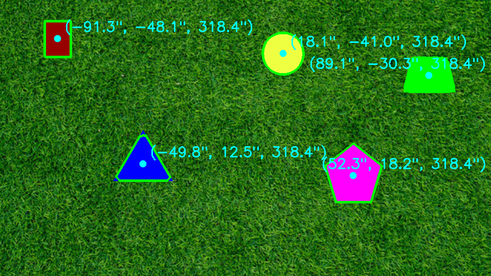

# PennAIR 2024 Software Challenge

Detects shapes from a live video feed on any background, traces their outlines, marks their
centers, and reports each center in 3D relative to the camera.

## Running it

Locally (no ROS)

```bash
bash run.sh path/to/video10.mp4
```

Under ROS 2 — build once, then run any time (launches the two nodes plus a viewer window):

```bash
bash setup.sh                    # once: installs ROS 2 + deps if missing, builds the package
bash launch.sh video10.mp4       # each run
```

For the 3D numbers, in another terminal:

```bash
source ~/ros2_ws/install/setup.bash && ros2 topic echo /centers
```

---

## 1. Code Implementation

```
algorithm.py                          the detector, OpenCV only
demo.py                               local runner
run.sh                                run locally (makes a venv)
setup.sh / launch.sh                  build once / run under ROS 2
pennair_ros2/video_publisher.py       node: video -> sensor_msgs/Image
pennair_ros2/shape_detector.py        node: detect, publish results
pennair_ros2/viewer.py                node: show /image_annotated
```

The pipeline was reached mostly by trial and error, each stage added against a failure on
the footage. Steps of `detect()`, which takes one `frame`; `out ← in` shows what each reads
and produces.

1. `gray ← frame` — grayscale.
2. `texture ← gray` — local high-pass magnitude: how busy each pixel's neighborhood is.
3. `mask ← texture` — the smooth pixels, thresholded against this frame's median texture.
4. `edge ← frame` — color-edge strength, strongest channel.
5. `inner, outer ← mask` — mask eroded to sure-interior and dilated to sure-background; the
   real border gets refined in the gap between them.
6. `cut ← inner, edge` — drop inner pixels on any edge as strong as a real outline, cutting
   overlapping shapes apart.
7. `markers ← inner, cut` — number each object; split only where `cut` left two real pieces.
8. `markers ← watershed(markers, frame)` — grows each marker outward until it meets another
   at a real edge, filling every pixel with its region's label (updates `markers` in place).
9. `found ← markers` — trace the regions, drop anything too small, large, or background-wide.
10. `3D ← found` — the circle sets the depth, then each center converts to inches.

ROS nodes are thin wrappers around `detect()`. Topics: `/centers` (`PoseArray`, meters,
camera frame), `/outlines` (`MarkerArray`), `/image_annotated` (`Image`).

---

## 2. Static Image Results



Two cues that fail in opposite situations. Texture separates object from background: a
uniform object surface carries less detail than a noisy background, so the two split even at
the same color. Color edges separate object from object where one overlaps another, or where
the background is smooth like the shapes.

Depth uses the circle, whose real radius (10 in) we know. Things shrink with distance, so
`Z = fx · R_inches / r_pixels`. `fx` is the focal length in pixels — it comes from the
supplied camera matrix, scaled by how wide the frame is versus the calibration width. The
flat ground puts every shape at that `Z`, and each center scales from pixels to inches by the
same ratio. A clipped or heavily-covered circle measures too small, so we skip it and hold
the last depth, which is fine since the shared depth never changes.

Challenges: Canny fired on the gradients inside the shapes in more complex cases, not just
their edges, which gave me the idea to capture texture via entropy instead. True entropy
worked but runs a histogram per pixel, far too slow. I replaced it with a cheap stand-in for
the same idea: blur the frame, subtract it from the original to get what the blur threw away
(the fine detail), and average that over a small window. Smooth surfaces score near zero, a
noisy background scores high. For overlaps, splitting by shape geometry alone missed the
pentagon/trapezoid pair, so we cut along the real color seam between them instead.

---

## 3. Video Results

<video src="dynamic_result.mp4" controls width="100%"></video>

[`dynamic_result.mp4`](dynamic_result.mp4)

The overlaid fps is detection throughput — how many frames per second `detect()` processes,
not a playback rate. It's the number that matters for a live feed: above the incoming 30 fps
means the detector keeps up. It runs ~35 fps at 1080p on my MacBook (a touch lower here,
since writing the output file competes for time). The main speedup was removing background
noise specks before dilation, which otherwise blow up the area watershed has to resolve; the
edge map also runs at half resolution.

---

## 4. Background Agnostic Results

<video src="dynamic_hard_result.mp4" controls width="100%"></video>

[`dynamic_hard_result.mp4`](dynamic_hard_result.mp4)

Same code as the grass video, no retuning. Three things make it background-independent:

1. Texture, not color, as the object cue. The detector assumes nothing about what the
   background looks like, only that an object surface is smoother than the background around
   it. Grass and asphalt are both busy; the shapes read as calm on either.

2. Thresholds relative to each frame. The mask keeps pixels below a fraction of that frame's
   median texture, and the seam test compares against that frame's own outline contrast.
   Changing the background just changes those numbers; the code stays the same.

3. A high-pass before measuring texture, and color seams for overlaps. The high-pass makes a
   gradient-filled shape read as smooth (this is what kept the film-grained white trapezoid
   as one piece), and the overlap cut keys on the color boundary between shapes, which does
   not depend on the background at all.

The one assumption is that objects are as smooth as or smoother than their background, which
is reasonable given their uniform nature. A noisy or patterned object could just as validly
be split into several sub-objects.